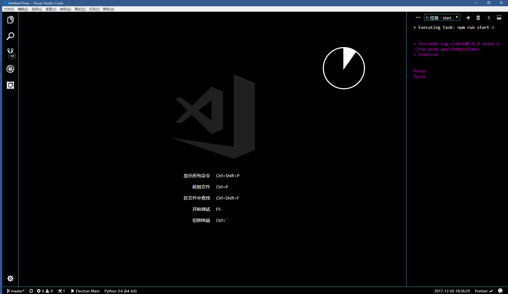

# theNextTimer

这是[the_next_step](https://github.com/findNextStep)的第一个app

是一个简单的,基于`electron`实现的计时器

## 环境需要

开发环境为`node -v v6.11.2`,使用`electron`构建GUI并使用`typesctipt`构建程序代码

# 预期完成项

- [ ] 设定初始时间（默认为当前）和结束时间的计时器
- [ ] 设定初始时间（默认为当前）和持续时间的计时器
- [ ] 设定的时间会得到记录并在完成后删除
- [ ] 设定的事件拥有属性
      - [ ] 事件名称
      - [ ] 事件地点