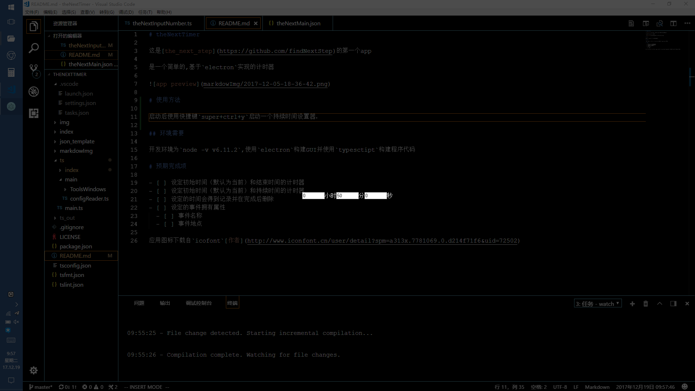
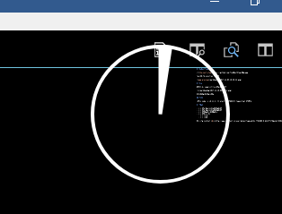

# theNextTimer

这是[the_next_step](https://github.com/findNextStep)的第一个app

是一个简单的,基于`electron`实现的计时器

# 使用方法

启动后使用快捷键`super+ctrl+y`启动一个持续时间设置器

设置运行持续时间之后会出现一个计时圆盘

也可以通过快捷键`super+ctrl+t`设置计时的结束时间

通过快捷键`super+ctrl+q`退出程序

可以通过修改用户文件夹下的`\the_next_app_config\theNextMain.json`实现快捷键的更改

## 环境需要

开发环境为`node -v v6.11.2`,使用`electron`构建GUI并使用`typesctipt`构建程序代码

# 预期完成项

- [ ] 设定初始时间（默认为当前）和结束时间的计时器
- [ ] 设定初始时间（默认为当前）和持续时间的计时器
- [ ] 设定的时间会得到记录并在完成后删除
- [ ] 设定的事件拥有属性
  - [ ] 事件名称
  - [ ] 事件地点

应用图标下载自`icofont`[作者](http://www.iconfont.cn/user/detail?spm=a313x.7781069.0.d214f71f6&uid=72502)